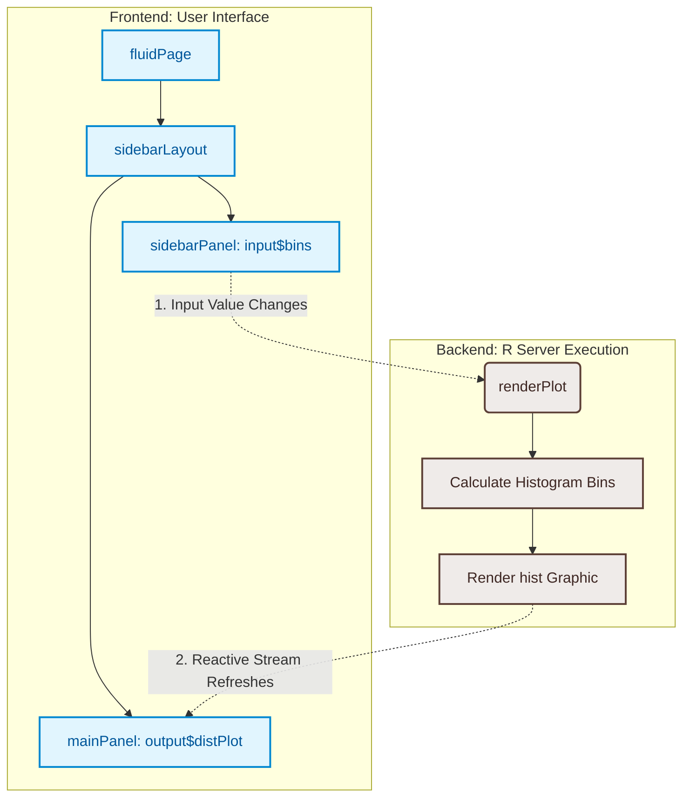

# Understanding a Basic Shiny Application

Welcome to the **Shiny Apps** repository! This project serves as a foundational guide to understanding the structural architecture and reactive mechanics of an **R Shiny** web application.

Shiny allows data scientists and analysts to convert complex R scripts into production-ready, interactive web applications seamlessly—without requiring a front-end stack like HTML, CSS, or JavaScript.

---

## 🗺️ System Architecture

A standard Shiny application relies on a **Client-Server** model. Communication flows dynamically between these layers via a concept called **Reactivity**. When a user modifies an input on the web layout, the backend server automatically calculates and pushes the refreshed outputs back to the interface.



---

## 🚀 Live Application Blueprint

The application visualizes Old Faithful Geyser waiting times by letting users adjust the histogram's resolution dynamically using a slider.

| Component | UI Function | Server Variable / Binding | Functionality |
| --- | --- | --- | --- |
| **Input Selector** | `sliderInput()` | `input$bins` | Allows the user to select custom histogram bins (Range: 1–50). |
| **Output Container** | `plotOutput()` | `output$distPlot` | Reserves screen real estate to render the reactive histogram. |
| **Reactive Wrapper** | N/A | `renderPlot()` | Actively listens for changes in `input$bins` and recalculates the plot. |

---

## 💻 Code Structural Breakdown

### 1. The Frontend (UI Elements)

The UI defines how your web application is structured and styled visually.

```r
ui <- fluidPage(
  titlePanel("My First Shiny App"),
  
  sidebarLayout(
    sidebarPanel(
      sliderInput(
        inputId = "bins", 
        label = "Number of bins:", 
        min = 1, 
        max = 50, 
        value = 30
      )
    ),
    
    mainPanel(
      plotOutput(outputId = "distPlot")
    )
  )
)

```

* **`fluidPage()`**: Implements a mobile-responsive grid container that automatically scales with the user's browser window size.
* **`sidebarLayout()`**: Standard design pattern that splits the screen into a 1/3-width left-hand control panel and a 2/3-width right-hand presentation canvas.
* **`sliderInput()`**: Creates a native HTML5 slider widget. The parameter `inputId = "bins"` creates the state variable passed to the server.
* **`plotOutput()`**: Allocates a dynamic graphics slot on the page named `"distPlot"` to capture server-rendered plots.

### 2. The Backend (Server Logic)

The server processes your data computations and handles graphical updates.

```r
server <- function(input, output) {
  output$distPlot <- renderPlot({
    # Access target dataset vector
    x    <- faithful$waiting 
    
    # Calculate reactive bin intervals
    bins <- seq(min(x), max(x), length.out = input$bins + 1) 
    
    # Generate the base plot
    hist(
      x, 
      breaks = bins, 
      col = "#75AADB", 
      border = "white",
      xlab = "Waiting time to next eruption (in mins)",
      main = "Histogram of Waiting Times"
    )
  })
}

```

* **`input` & `output**`: Core list-like objects passed by Shiny. `input` reads incoming frontend data (`input$bins`), while `output` stores user-facing metrics (`output$distPlot`).
* **`renderPlot()`**: A reactive execution scope. It acts as an active listener; whenever `input$bins` changes, it re-runs the entire internal script block to rebuild the plot from scratch.

---

## 🛠️ Installation & Local Deployment

To run this application locally on your machine, ensure you have **R** and **RStudio** installed, then execute the following steps:

1. Clone this repository to your environment:
```bash
git clone https://github.com/Vipeen21/shiny-apps.git

```


2. Open your R console and install the Shiny package if you haven't already:
```r
install.packages("shiny")

```


3. Boot the application using the `shiny` package wrapper:
```r
library(shiny)
shinyApp(ui = ui, server = server)

```
